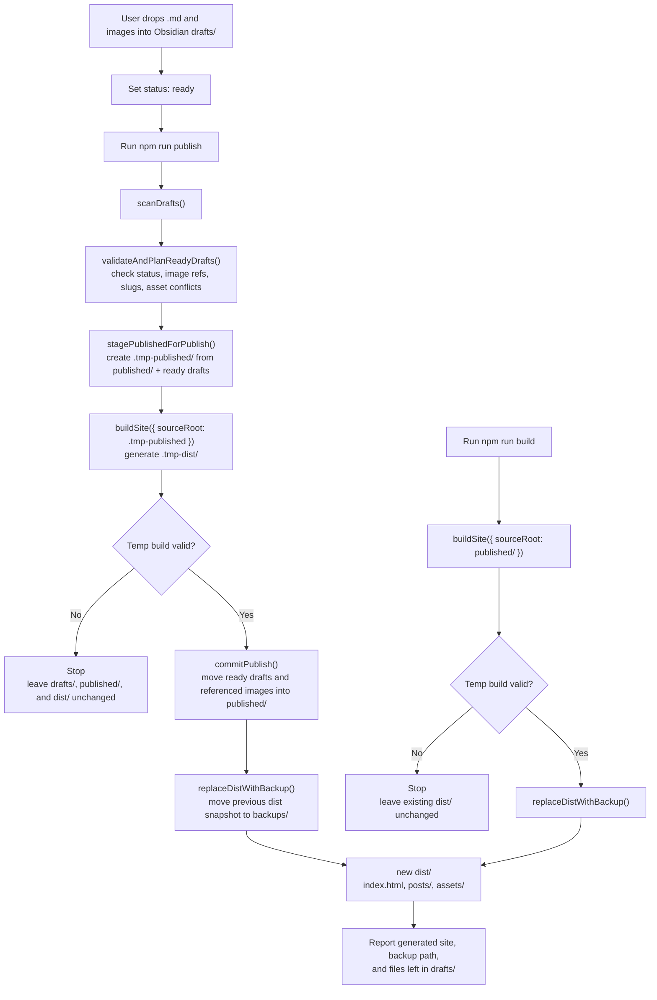
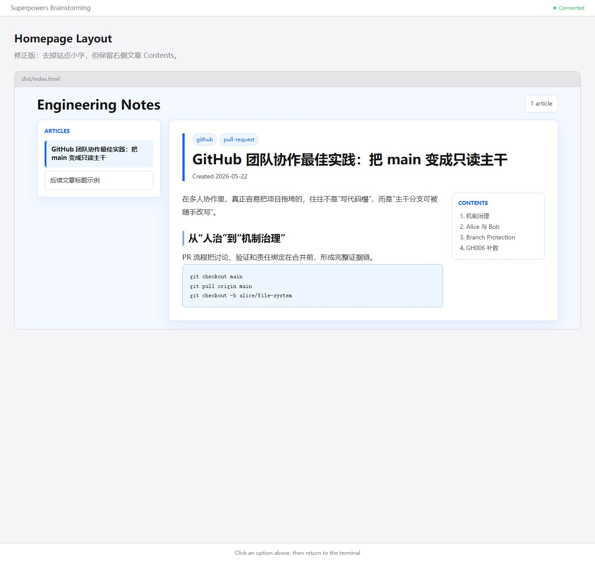

# Markdown HTML Blog Design

## Goal

Build a small static blog publisher that converts Obsidian Markdown files with local images into HTML pages. The workflow must let the user drop ready-to-publish notes into an Obsidian drafts folder, publish only notes marked `status: ready`, and then move successfully published source files into an Obsidian published folder.

## Current Inputs

- Obsidian blog drafts folder: `<OBSIDIAN_BLOG_DRAFTS>`
- Obsidian blog published folder: `<OBSIDIAN_BLOG_PUBLISHED>`
- Source article and images are managed from those Obsidian folders.
- The current directory is not a git repository.

## Directory Model

Obsidian remains the writing and source-content workspace. This project remains the publisher and generated-site workspace. Do not move the whole publisher project into the Obsidian vault.

Obsidian content folders:

```text
<OBSIDIAN_VAULT_ROOT>/
  4_Outputs/
    blogs/
      drafts/       # User drop zone for new Markdown files and their images.
      published/    # Published Markdown files and images that should remain on the site.
```

Publisher project folders:

```text
<PROJECT_ROOT>/
  package.json
  blog.config.json
  scripts/
    blog.js

  dist/
    index.html
    posts/
    assets/

  backups/
    dist-YYYYMMDD-HHMMSS/

  .tmp-published/  # Temporary staged published source; generated and removed by scripts.
  .tmp-dist/       # Temporary generated site before replacing dist/.
```

Configuration:

```json
{
  "siteTitle": "Engineering Notes",
  "obsidianVaultRoot": "<OBSIDIAN_VAULT_ROOT>",
  "draftsDir": "4_Outputs/blogs/drafts",
  "publishedDir": "4_Outputs/blogs/published"
}
```

Path portability rules:

- Runtime code must not hard-code machine-specific absolute paths.
- Project-local output and temporary folders must be resolved relative to the project root or current working directory:
  - `dist/`
  - `backups/`
  - `.tmp-published/`
  - `.tmp-dist/`
- Obsidian source folders must come from `blog.config.json` or environment-variable overrides, not from hard-coded JavaScript constants.
- If `draftsDir` or `publishedDir` is relative, resolve it from `obsidianVaultRoot`.
- If `draftsDir` or `publishedDir` is absolute, use it directly.
- Moving the publisher project to Linux should only require updating `blog.config.json` or environment variables for the Obsidian paths; JavaScript code should not need changes.
- The homepage screenshot path later in this design document is a repository-relative documentation asset, not a runtime dependency.

Optional environment-variable overrides:

```bash
OBSIDIAN_BLOG_DRAFTS=<OBSIDIAN_BLOG_DRAFTS> \
OBSIDIAN_BLOG_PUBLISHED=<OBSIDIAN_BLOG_PUBLISHED> \
npm run publish
```

Example configurations:

```json
{
  "siteTitle": "Engineering Notes",
  "obsidianVaultRoot": "D:/obsidian/hermes_ws",
  "draftsDir": "4_Outputs/blogs/drafts",
  "publishedDir": "4_Outputs/blogs/published"
}
```

```json
{
  "siteTitle": "Engineering Notes",
  "obsidianVaultRoot": "/home/user/obsidian/hermes_ws",
  "draftsDir": "4_Outputs/blogs/drafts",
  "publishedDir": "4_Outputs/blogs/published"
}
```

## Git And Linux Migration

The publisher project should be portable. Moving it to Linux should not require copying generated output or machine-specific local files.

Commit these project files to git:

```text
package.json
package-lock.json
blog.config.example.json
scripts/
docs/
```

Optionally commit:

```text
README.md
.gitignore
```

Do not commit:

```text
node_modules/
dist/
backups/
.tmp-published/
.tmp-dist/
blog.config.json       # local machine-specific config
```

`blog.config.example.json` should contain portable placeholders:

```json
{
  "siteTitle": "Engineering Notes",
  "obsidianVaultRoot": "<OBSIDIAN_VAULT_ROOT>",
  "draftsDir": "4_Outputs/blogs/drafts",
  "publishedDir": "4_Outputs/blogs/published"
}
```

On Linux:

1. Clone the publisher project from git.
2. Ensure the Obsidian vault is available on the Linux VM.
3. Copy `blog.config.example.json` to `blog.config.json`.
4. Set `obsidianVaultRoot` to the Linux vault path, such as `/home/user/obsidian/hermes_ws`.
5. Run `npm install`.
6. Run `npm run build` to generate HTML from existing Obsidian `published/` content.
7. Run `npm run publish` when there are `status: ready` files in Obsidian `drafts/`.

Linux example `blog.config.json`:

```json
{
  "siteTitle": "Engineering Notes",
  "obsidianVaultRoot": "/home/user/obsidian/hermes_ws",
  "draftsDir": "4_Outputs/blogs/drafts",
  "publishedDir": "4_Outputs/blogs/published"
}
```

This means Linux only needs:

- The publisher project cloned from git.
- The Obsidian vault available locally on the Linux VM.
- A local `blog.config.json` pointing to that vault.

After that, `npm run build` can regenerate `dist/` from Obsidian `published/`, and `npm run publish` can move ready drafts into `published/` and regenerate the HTML site.

Directory responsibility diagram:

```text
Obsidian source folders                      Publisher output folders

User drop zone          Published source          Generated website
+-------------+         +-------------+          +-------------+
| drafts/     |  ---->  | published/  |  ---->   | dist/       |
| ready md/img|         | md/images   |          | html/assets |
+-------------+         +-------------+          +-------------+
                              |                         ^
                              |                         |
                              +-------------------------+
                                      rebuild input

Previous generated website snapshots
+-------------------------+
| backups/                |
|   dist-YYYYMMDD-HHMMSS/ |
|   dist-YYYYMMDD-HHMMSS/ |
+-------------------------+
```

Only the Obsidian `drafts\` folder represents new work waiting to be published. The Obsidian `published\` folder is the canonical source for articles already on the site.

User workflow for a new article:

1. Put the new `.md` file into `<OBSIDIAN_BLOG_DRAFTS>`.
2. Put that article's local images into the same drafts folder.
3. Set the Markdown front matter to `status: ready`.
4. Run `npm run publish` from the publisher project.

The user should not have to split new files into separate `posts` and `assets` folders manually.

Workflow diagram:



## Commands

### `npm run publish`

Publishes ready Obsidian drafts.

1. Scan only the configured Obsidian `draftsDir` for Markdown files and supported image files.
2. Treat `.md` files with front matter `status: ready` as ready-to-publish articles.
3. Leave Markdown files without `status: ready` in `draftsDir` untouched and report them as skipped.
4. Treat `.png`, `.jpg`, `.jpeg`, `.gif`, `.webp`, and `.svg` files in `draftsDir` as draft assets.
5. Validate that each ready article's referenced local images exist in `draftsDir` or already exist in `publishedDir`.
6. Plan destination paths for ready Markdown and referenced assets, including slug and asset-name conflict resolution.
7. Create `.tmp-published/` as a staged source snapshot containing existing `publishedDir` plus the ready draft articles and referenced draft assets.
8. Build the full static site from `.tmp-published/` into `.tmp-dist/`.
9. Validate `.tmp-dist/`.
10. If validation fails, leave `draftsDir`, `publishedDir`, and `dist/` unchanged.
11. If validation succeeds, move the ready Markdown and referenced draft assets into `publishedDir` using the planned destination paths.
12. Back up the previous `dist/`, replace it with `.tmp-dist/`, and report the backup path.
13. Leave unrelated, unreferenced, or not-ready files in `draftsDir` and report them.

The first version scans only the top level of `draftsDir`; it does not recursively scan subfolders.

Already published Markdown files in `publishedDir` are not treated as new draft articles and are not moved again.

### `npm run build`

Regenerates the static site from already published content.

1. Scan the configured Obsidian `publishedDir`.
2. Parse each Markdown file and its front matter.
3. Render the site into `.tmp-dist/`.
4. Validate `.tmp-dist/`.
5. Back up the previous `dist/`, then replace it with `.tmp-dist/`.

This command does not read or modify `draftsDir`.

### Command Relationship

`publish` and `build` should share the same internal site-generation function. That shared function should generate and validate a temporary site, not directly mutate `dist/`.

Implementation shape:

```js
async function publish() {
  const draftFiles = scanDrafts();
  const publishPlan = validateAndPlanReadyDrafts(draftFiles);
  const stagedSource = stagePublishedForPublish(publishPlan);
  const tempDist = await buildSite({ sourceRoot: stagedSource });
  commitPublish(publishPlan, tempDist);
}

async function build() {
  const tempDist = await buildSite({ sourceRoot: config.publishedDir });
  replaceDistWithBackup(tempDist);
}
```

`npm run publish` should not duplicate the build logic. It should call the shared `buildSite()` function to create a validated `.tmp-dist/`, then commit the ready draft files and replace `dist/` only after that temporary build succeeds.

The purpose of each command is different:

- `npm run publish`: use when there are `status: ready` Markdown files in Obsidian `draftsDir`; it validates and moves ready content into `publishedDir`, then rebuilds the site.
- `npm run build`: use when there is no new ready draft but the generated site needs to be recreated from Obsidian `publishedDir`.

Examples for `npm run build`:

- CSS or HTML templates changed.
- A typo was fixed in an already published Markdown file under Obsidian `publishedDir`.
- A published image in Obsidian `publishedDir` was replaced.
- A published article was deleted from Obsidian `publishedDir`.
- `dist/` was deleted or needs to be regenerated before deployment.

## Markdown Parsing

Use established Node.js libraries rather than hand-writing a Markdown parser.

- `gray-matter` parses front matter.
- `marked` or `markdown-it` converts Markdown body content to HTML.

For each article, extract:

- `title`: first `#` heading, falling back to the file name.
- `created`: from front matter, used for sorting. If missing, use the Markdown file's modified date. If present but invalid, warn and fall back to the modified date.
- `tags`: from front matter when present.
- `status`: controls publish eligibility in Obsidian `draftsDir`; only `status: ready` draft Markdown files are published. Published Markdown files in `publishedDir` are included in builds regardless of `status`.
- `target`: parsed and retained in the post object for future use, but the first version does not display it or use it for filtering or publishing decisions.
- `slug`: required from front matter for ready drafts and published articles.
- `toc`: generated from article body headings according to the table-of-contents rules below.
- `images`: local Markdown image references.

Table of contents rules:

- Treat the first `#` heading as the article title and do not include it in the table of contents.
- Scan remaining headings from `##` through `######`.
- Use the shallowest heading level present in the article body as the main TOC level.
- Include headings one level deeper as nested TOC items.
- Ignore deeper levels to keep the TOC readable.
- If the article body has no headings after the title, do not render the Contents block.

## Slug Rules

A slug is the stable URL/file-name identifier for an article.

Priority:

1. Use `slug` from front matter if present.
2. For ready drafts during `npm run publish`, `slug` is required. If a ready draft is missing `slug`, stop publishing and print a friendly message naming the Markdown file and showing an example front matter value.
3. For already published files during `npm run build`, `slug` is also required. If a published file is missing `slug`, fail the build with a clear message naming the file.
4. If two slugs conflict, append `-2`, `-3`, and so on.

The slug is used for article URLs such as:

```text
dist/posts/github-team-collaboration-main-readonly.html
```

Example required front matter:

```yaml
---
status: ready
slug: github-team-collaboration-main-readonly
created: 2026-05-22
tags:
  - github
---
```

## HTML Output

The generated site uses the selected technical-blog layout:

- Homepage with a two-column reader layout: article directory on the left and the latest article content on the right.
- Standalone article pages with the same shell and reading style, for direct sharing.
- Left homepage directory containing the site title, article count, and articles sorted by `created` descending. Do not show a small eyebrow label such as "Markdown HTML Blog" above the site title.
- Article pages with a main reading column and a sidebar containing date, tags, and table of contents.
- Responsive layout that collapses cleanly on narrow screens.
- Built-in styling for Chinese text, images, code blocks, headings, and links.

The generated HTML should be static and directly viewable from the file system or a simple static server.

Homepage directory behavior:

- Show published articles in reverse chronological order.
- On `index.html`, highlight the latest article because it is the article displayed on the right.
- On standalone article pages, highlight that page's article in the left directory.
- Article titles in the left directory link to `posts/<slug>.html`; the first version does not need client-side article switching.
- Show each directory item with the article title only.
- Keep the first version simple; tag filtering and year/month collapsing can be added later if the article count grows.
- If there are no published articles, render a friendly empty-state homepage with the site title and a short message such as `No articles yet. Add a ready Markdown file to the Obsidian blogs/drafts folder and run npm run publish.`

Homepage visual layout:



The preview image file lives at `docs/superpowers/specs/assets/homepage-layout-preview.png`. This documentation asset is not a runtime dependency.

- The top header shows only the site title, such as `Engineering Notes`, and a small article count badge.
- Do not show an eyebrow label above the site title, such as `Markdown HTML Blog`.
- The main page uses two columns on desktop:
  - Left column: an `Articles` panel containing the published article titles.
  - Right column: the currently displayed article content.
- The left `Articles` panel highlights the current article with the accent blue border and soft blue background.
- On desktop, the left `Articles` panel should be sticky and scroll internally when there are more articles than fit on screen.
- Use a rule such as `max-height: calc(100vh - 36px); overflow-y: auto;` for the desktop article list panel.
- The right article area uses the selected left-accent title block with tags, title, and created date.
- Within the right article area, render the article body and a `Contents` block when the article has usable headings.
- If the current article has no usable headings after the title, omit the `Contents` block entirely.
- On smaller screens, stack the site header, article list, and article content into a single column, and disable the left panel's sticky positioning and internal scroll.

## Visual Style

Use a professional light-blue design direction inspired by mature design-system color token patterns. The site should feel like a focused technical blog, not a marketing page.

Color roles:

```css
--page-bg: #f4f8ff;
--surface: #ffffff;
--surface-soft: #edf5ff;
--border: #d0e2ff;
--border-strong: #a6c8ff;
--text: #161616;
--text-muted: #525252;
--accent: #0f62fe;
--accent-soft: #78a9ff;
```

Style rules:

- Use neutral text colors for reading and blue tokens for links, headings accents, borders, tags, and focus states.
- Keep the article reading surface white for contrast and readability.
- Use `#f4f8ff` as the page background and `#edf5ff` for subtle code blocks, image frames, and soft UI surfaces.
- Code blocks should use a light background, not a dark theme.
- Avoid decorative gradients, heavy shadows, and one-off colors outside the token set.
- Cards and panels should use restrained borders, subtle shadows, and border radius no larger than 8px.
- Article title blocks should use a left blue accent border, compact tag chips, the article title, and a muted date line. Avoid large hero-style title bands.

## Asset Handling

Images referenced by published articles are copied into `dist/assets/`.

Draft publishing rules:

- During `publish`, missing images fail the publish step so a broken page is not released.
- Files are moved from Obsidian `draftsDir` to Obsidian `publishedDir` only after validation and temporary site generation succeed.
- If a ready draft references the same image name as an existing published asset, compare file contents before reusing it.
- If the existing asset has the same name and same content, reuse the existing published asset.
- If the existing asset has the same name but different content, rename the draft asset with a safe suffix such as `image-2.png` or `image-<short-hash>.png`.
- When a draft asset is renamed, rewrite the affected Markdown image reference before moving the article into `publishedDir`, so future `npm run build` runs continue to resolve the image correctly.
- If a referenced image is also referenced by a not-ready draft, copy it into `publishedDir` instead of moving it, so the not-ready draft does not break inside Obsidian.
- Unreferenced image files in `draftsDir` should remain there and be reported instead of being silently published.

Build rules:

- During `build`, missing published assets should fail with a clear message naming the article and image path.
- Generated HTML should reference copied files under `../assets/` from article pages and `assets/` from the index.

## Error Handling

- No Markdown files in Obsidian `draftsDir` during `publish`: print a friendly "no draft articles found" message and exit successfully.
- Markdown files exist in Obsidian `draftsDir` but none have `status: ready`: print a friendly "no ready draft articles to publish" message and exit successfully.
- Obsidian `draftsDir` is missing or unreadable: fail with a clear message asking the user to check `blog.config.json`.
- A ready draft is missing required `slug` front matter: fail before moving files, name the Markdown file, and show an example `slug` value.
- No Markdown files in Obsidian `publishedDir` during `build`: generate an empty-state homepage instead of failing.
- A published Markdown file is missing required `slug` front matter: fail the build and name the file.
- Invalid front matter: fail and print the Markdown file path.
- Missing image during `publish`: fail before moving files.
- Missing image during `build`: fail and print the article and image path.
- Slug conflict: resolve automatically by suffixing a number.
- Existing `dist/`: do not delete it directly. Build into a temporary directory first, then back up the existing `dist/` and replace it only after the new build succeeds.
- Temporary directories such as `.tmp-published/` and `.tmp-dist/`: clean them before starting a new run, and remove them after a successful run. If a run fails, leave them in place only when useful for debugging and print their paths.

## User-Facing Command Output

Command output should be concise and reassuring.

For `npm run publish`, print:

- Draft Markdown files found.
- Draft Markdown files skipped because `status` is not `ready`.
- Ready drafts missing required metadata such as `slug`, if any.
- Images referenced and whether they came from `draftsDir` or existing `publishedDir`.
- Any asset renames caused by same-name different-content conflicts.
- Markdown files moved into Obsidian `publishedDir`.
- Assets moved or copied into Obsidian `publishedDir`.
- Generated site path: `dist/index.html`.
- Backup path when the previous `dist/` snapshot was moved.
- Files left in Obsidian `draftsDir`, if any.

For `npm run build`, print:

- Number of published articles loaded from Obsidian `publishedDir`.
- Whether an empty-state homepage was generated.
- Generated site path: `dist/index.html`.
- Backup path when the previous `dist/` snapshot was moved.

## Dist Replacement and Backups

The build process should avoid destructive in-place updates to `dist/`.

Build flow:

1. Generate the complete site into a temporary directory such as `.tmp-dist/`.
2. Validate that `.tmp-dist/index.html` exists and the expected article and asset files were written.
3. If validation fails, leave the existing `dist/` unchanged.
4. If validation succeeds and `dist/` exists, move `dist/` to `backups/dist-YYYYMMDD-HHMMSS/`.
5. Move `.tmp-dist/` to `dist/`.
6. Report the backup path.

This keeps the previous generated site available if the new build output looks wrong after publishing. The first implementation can keep all backups unless cleanup is requested later.

For `publish`, the temporary build should be created from `.tmp-published/`, not from partially moved files. Commit order should be:

1. Validate ready draft files.
2. Generate `.tmp-published/`.
3. Generate and validate `.tmp-dist/` from `.tmp-published/`.
4. Move ready draft files into Obsidian `publishedDir`.
5. Replace `dist/` using the backup flow above.

If steps 1-3 fail, Obsidian `draftsDir`, Obsidian `publishedDir`, and `dist/` must remain unchanged. If step 4 fails, do not replace `dist/`; report the failed move so the user can retry. If step 5 fails after `publishedDir` has been updated, report that `publishedDir` is updated and `npm run build` can be rerun to regenerate `dist/`.

## Verification

After implementation, verify by scenario.

Initial setup and first publish:

```bash
npm install
npm run publish
```

Expected results:

- `dist/index.html` exists.
- At least one article page exists in `dist/posts/`.
- Referenced Obsidian draft images are copied into `dist/assets/`.
- The generated article shows Chinese text, the local image, code blocks, tags, date, and sidebar table of contents.

Rebuild-only verification:

```bash
npm run build
```

Use this when dependencies are already installed and there are no new ready drafts. This verifies that the site can be regenerated from Obsidian `publishedDir` after CSS, template, published article, or published asset changes.

Idempotency check:

```bash
npm run publish
```

Expected result:

- Running `npm run publish` again with no `status: ready` draft Markdown files does not reprocess the already published Markdown as a new draft article.

## Performance

The first implementation should do a full rebuild of `dist/` after every successful `publish` or `build`.

This does repeat work when only one new article is added, because existing article pages and asset copies may be regenerated. That trade-off is intentional for the first version:

- It keeps the implementation simple and predictable.
- It avoids cache invalidation, dependency tracking, and stale generated files.
- It is fast enough for a small or medium personal blog.

Incremental generation can be added later if the site grows large enough to make full rebuilds noticeably slow. A future incremental mode would only render new or changed article pages, copy changed assets, and update the homepage.

## Implementation Notes

The first implementation should stay small:

- One Node.js build/publish script is acceptable.
- Keep templates as functions or small local strings unless they become hard to read.
- Do not add a full static-site framework for the initial version.
- Keep generated output in project-local `dist/` and published source content in Obsidian `publishedDir`.
- Use plain Node.js JavaScript for the first version. TypeScript can be introduced later if the script grows beyond one focused file or gains more complex data models.

## JavaScript Structure

Use npm scripts as command entry points:

```json
{
  "scripts": {
    "publish": "node scripts/blog.js publish",
    "build": "node scripts/blog.js build"
  }
}
```

Recommended file:

```text
scripts/blog.js
```

Command dispatch:

```js
async function main() {
  const command = process.argv[2];

  if (command === 'publish') {
    await publish();
  } else if (command === 'build') {
    await build();
  } else {
    printUsageAndExit();
  }
}
```

Core functions:

```js
async function publish() {}
async function build() {}
async function buildSite() {}

function loadConfig() {}
function ensureProjectFolders() {}
function scanDrafts() {}
function validateAndPlanReadyDrafts(draftFiles) {}
function stagePublishedForPublish(publishPlan) {}
function commitPublish(publishPlan, tempDist) {}

function loadPublishedPosts() {}
function parseMarkdownPost(filePath) {}
function extractLocalImages(markdown) {}
function createSlug(post, usedSlugs) {}
function createTableOfContents(markdownOrHtml) {}
function resolveAssetDestinations(post, draftAssets) {}

function renderHomePage(posts) {}
function renderPostPage(post, allPosts) {}
function renderLayout({ title, body, pageType }) {}
function renderStyles() {}
function copyContentAssets(posts) {}
function writeBuildToTemp(posts, tempDist) {}
function validateTempDist(posts) {}
function replaceDistWithBackup(tempDist) {}
function timestampForBackup() {}
```

Suggested data shapes:

```js
const post = {
  sourcePath: '<OBSIDIAN_BLOG_PUBLISHED>/example.md',
  outputPath: '<PROJECT_ROOT>/dist/posts/example.html',
  slug: 'example',
  title: 'Example title',
  created: '2026-05-24',
  status: 'draft',
  target: 'blog',
  tags: ['github'],
  toc: [
    { level: 2, id: 'section-id', text: 'Section title' }
  ],
  images: [
    { original: 'image.png', publishedPath: '<OBSIDIAN_BLOG_PUBLISHED>/image.png', outputPath: '<PROJECT_ROOT>/dist/assets/image.png' }
  ],
  html: '<p>Rendered markdown...</p>'
};
```

Implementation flow:

```text
publish()
  config = loadConfig()
  ensureProjectFolders()
  draftFiles = scanDrafts()
  publishPlan = validateAndPlanReadyDrafts(draftFiles)
  stagedSource = stagePublishedForPublish(publishPlan)
  tempDist = buildSite({ sourceRoot: stagedSource })
  commitPublish(publishPlan, tempDist)

build()
  config = loadConfig()
  ensureProjectFolders()
  tempDist = buildSite({ sourceRoot: config.publishedDir })
  replaceDistWithBackup(tempDist)

buildSite({ sourceRoot })
  loadPublishedPosts(sourceRoot)
  writeBuildToTemp()
  validateTempDist()
  return tempDist
```
